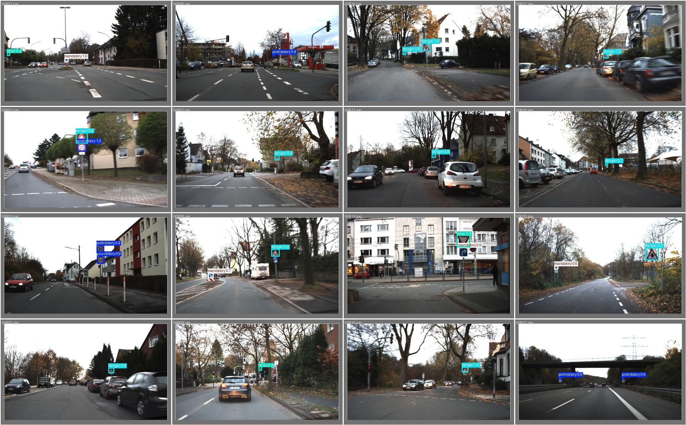
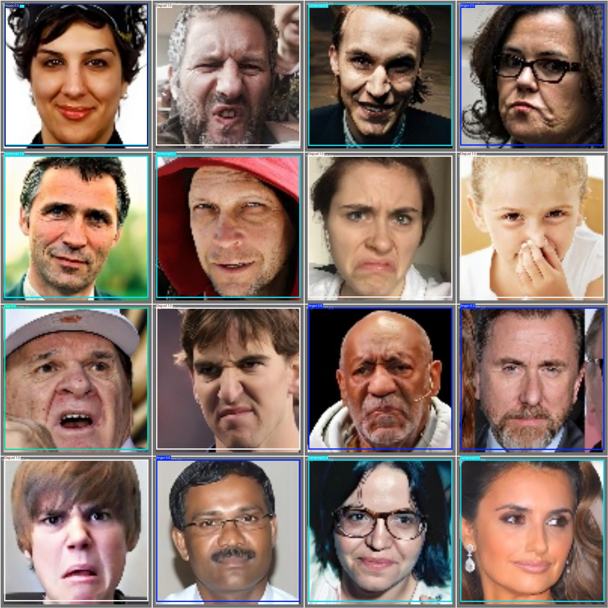
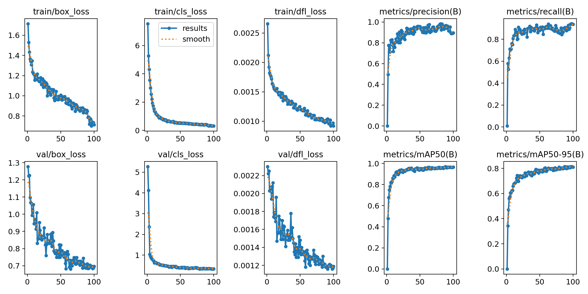
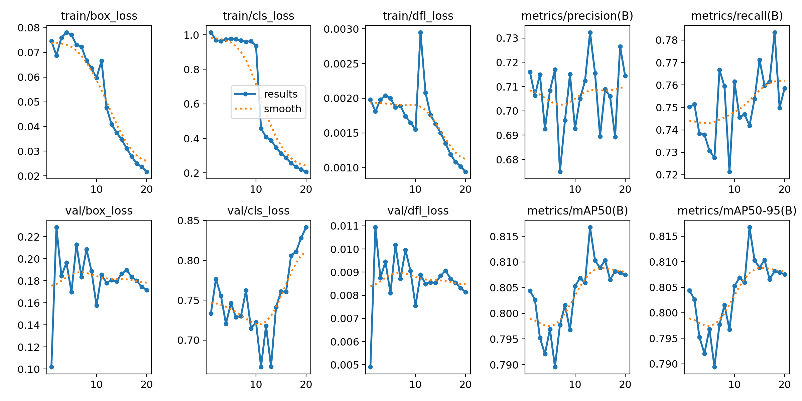

# 交通标志检测与人脸表情识别

<div align="center">
  
</div>

<div align="center">
  
  
  
  
</div>

这是一个面向智能交通与情绪交互场景的计算机视觉项目，基于 Ultralytics YOLO 实现交通标志识别与人脸表情识别，并通过 Streamlit 构建可视化演示界面。

项目覆盖从数据准备、模型训练、结果评估到应用展示的完整流程，能够在本地环境中快速验证模型效果，并为后续功能扩展提供可复用的开发基础。

- 交通标志检测：面向道路场景中的交通信息识别与安全辅助
- 人脸表情识别：用于情绪状态分析与人机交互场景的视觉理解

## 项目亮点

- 基于 YOLO 的端到端检测流程
- 使用 Streamlit 构建轻量 Web 界面
- 支持两类自定义检测任务
- 提供真实模型推理结果与训练输出
- 包含训练日志、验证结果和演示图像

## 核心功能

### 1. 交通标志检测

系统能够识别常见交通标志类别，包括禁止标志、危险标志、强制标志以及其他相关类别，适用于智能交通和辅助驾驶场景。

### 2. 人脸表情识别

项目支持八类表情识别，包括愤怒、轻蔑、厌恶、恐惧、开心、中性、悲伤和惊讶，适用于情绪分析和人脸检测场景。

### 3. Web 应用界面

通过上传图片即可完成识别，并展示原图与检测结果图，界面由 Streamlit 提供，适合本地演示和功能展示。

### 4. 模型推理与分析

仓库中包含：

- 单张图像推理示例
- 摄像头实时推理示例
- 检测结果解析
- 训练结果可视化与评估图表

## 项目结构

```text
.
├── app.py
├── 01-预训练模型推理一张图片.py
├── 02-预训练模型推理摄像头.py
├── 03-推理结果解析.py
├── yolo26n.pt
├── LICENSE
├── README.md
├── pyproject.toml
├── .gitignore
├── datasets/
│   ├── traffic_signal/
│   └── FacialExpression/
├── runs/
│   └── detect/
├── images/
│   ├── upload/
│   └── result/
├── screenshots/
│   ├── traffic_signal_demo.jpg
│   ├── facial_expression_demo.jpg
│   ├── traffic_results.png
│   └── facial_results.png
└── ultralytics/
```

## 关于文件

本项目的关键文件职责如下：

- `app.py`：主界面程序，整合登录页、首页和两类检测功能，负责加载模型并调用 Streamlit 展示检测结果。
- `01-预训练模型推理一张图片.py`：演示单张图片推理流程，适用于快速验证模型效果。
- `02-预训练模型推理摄像头.py`：基于本地摄像头实时检测，可用于现场演示和实验验证。
- `03-推理结果解析.py`：读取并解析检测输出，提取类别、置信度和边界框信息，便于结果分析。
- `datasets/traffic_signal/`：交通标志数据集目录，包含训练/验证数据与配置文件。
- `datasets/FacialExpression/`：表情数据集目录，包含训练/验证数据与配置文件。
- `runs/`：保存训练过程中的权重、预测结果和可视化产物。
- `screenshots/`：项目展示图，主要用于 GitHub 介绍页和效果展示。
- `ultralytics/`：项目依赖的 Ultralytics YOLO 实现代码，提供模型推理和训练能力。

## 效果展示

### 交通标志检测


### 人脸表情识别



### 训练结果概览





## 数据与模型

该项目包含两类自定义数据集与已训练模型：

- 交通标志数据集：4 个类别
- 人脸表情数据集：8 个类别

模型输出保存在 `runs/` 目录中，包括验证预测图、混淆矩阵和训练曲线等结果。

## 发布说明

本仓库作为一个基于 YOLO 的计算机视觉示例项目，旨在提供一个简洁、可运行、便于演示和扩展的参考实现，涵盖本地推理、模型评估和应用层集成等关键流程。

重点特性包括：

- 基于 Ultralytics YOLO 框架
- 包含自定义数据集与验证结果
- 提供 Streamlit 可视化界面
- 适用于智能交通、人脸识别与扩展型视觉应用

## 环境依赖

当前项目已在本地 conda 环境 `shixun` 中验证可运行，实际使用的核心库如下：

```text
streamlit==1.56.0
ultralytics==8.4.39
torch==2.10.0
opencv-python==4.13.0
numpy==2.4.3
Pillow==12.2.0
matplotlib==3.10.8
PyYAML==6.0.3
requests==2.33.1
scipy==1.17.1
psutil==7.2.2
polars==1.40.0
```

### 环境准备

本项目基于 Ultralytics YOLO 框架，需在对应 Python 环境中运行。

```bash
conda activate shixun
```

### 运行 Web 应用

```bash
streamlit run app.py
```

### 运行单张图片推理

```bash
python 01-预训练模型推理一张图片.py
```

### 运行摄像头推理

```bash
python 02-预训练模型推理摄像头.py
```

### 解析检测结果

```bash
python 03-推理结果解析.py
```

## 说明

- 该应用适合本地演示和实验测试
- `app.py` 中的登录系统为简单演示用认证，不用于正式生产环境
- 项目可进一步扩展到交通监控、安全检测、人机交互等实际场景

## 许可证

本项目遵循 Ultralytics 代码库所采用的 AGPL-3.0 许可证，完整条款请见 [LICENSE](LICENSE)。

## 总结

该仓库展示了一个结构清晰、可运行、可演示的 YOLO 计算机视觉应用，包含训练模型、推理脚本、数据集和 Web 界面，适合用于项目展示、技术评审以及后续功能扩展。
